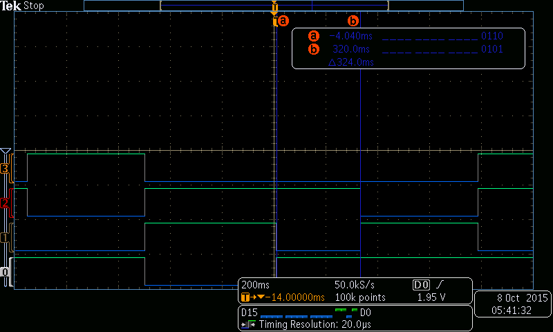
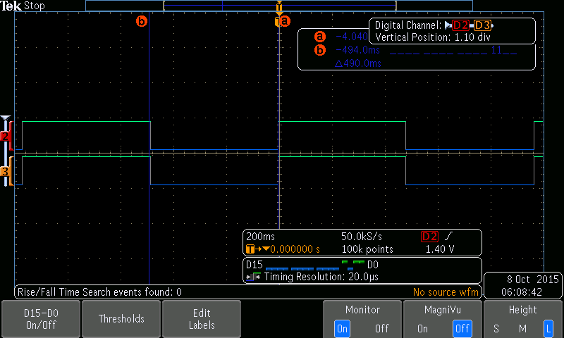

# ECE 3710 Project 1 - SUMO
**Erik Sargent and Westen Jensen**  
October 13, 2015


##Introduction
This game is fashioned after the ancient art of Sumo wrestling. Two LED lights light up across from each other on a bar LED, by pressing your button you move towards your opponents light. Each round starts with the LEDs moving apart, then the players race to press their buttons. The player who presses their button first will move forward and the other player has a short amount of time to also press their button to tie the round before they lose and the first player wins and advances. Following this procedure players are to compete against each other to push the other one to the end of the bar LED. When both LEDs are at one end of the bar LED, the game is over and the lights flash until the game is restarted.

##Scope
This document contain a complete description of the hardware and software design for SUMO. The full source code is located at the end of this document.

##Design Overview

###Requirements
1. The system shall run on `3.3V` DC supply.
2. The system shall use a 10 LED bar graph to display output of the game, on each end a button shall be in close proximity.
3. The system shall have 3 buttons, two player buttons and a reset button
4. The system shall have a DIP switch that will be used to calculate the speed of delay between turns.
5. After the system is reset, the two center LEDs of the bar graph shall flash at a rate of `2Hz`, which is controlled by a timer. The LED on the left represents player 1 and the LED on the right represents player 2.
6. Each player will indicate they are ready to play by pressing the button on their side of the LED bar graph.
7. The buttons shall be sampled at least every `5ms`.
8. Once a player presses their button to indicate they are ready to play their LED shall be lit solidly.
9. At some random time at least 1 second but no more than 2 seconds after (a) both players indicate their readiness to play or (b) a move concludes that does not end the game, the leftmost lit LED shall move one spot to the left and the rightmost lit LED shall move one spot to the right. This event starts the move.
10. After the move starts, each player races to press their button. As soon as a button is pressed, the corresponding players lit LED moves back to its prior position and a timer is started.
11.  If the timer in (9) expires before the opponent presses their button (and moves their lit LED), the quicker players lit LED shall move again and be adjacent to their opponent's lit LED. Otherwise, the move is a draw.
12. If the result of this move is that the two lit LEDs are on the leftmost or rightmost side of the bar graph, the game is over and the 2 lit LEDs shall ash at a rate of `2Hz` until the system is reset.
13. The delay time in (9) shall be based on the players speed, Sn, and the number of contiguous drawn moves, d. If player n is the first to press their button, the delay in milliseconds shall be $$2^{-min(d,4)} (320 – 80Sn)$$.

###Materials
* DC power Supply (3.3 Volt)
* Breadboard
* Momentary push button (2)
* 10 LED Bar graph
* 220Ω resistor for each LED
* Tiva C micro controller
* Assorted connection wires

###Theory of Operation
Upon power-up or reset the game shall start with the two middle LED’s flashing. Each player will then indicate their readiness to play by pressing the button on their end of the bar LED. After a player indicates they are ready, the LED on their side will be lit solid, once both players indicate they are ready to play at least 1 second but no longer than 2 seconds later the LEDs will move one LED away towards their respective sides indicating the game has begun. The players will now race to press their buttons to move in the direction of their opponent. If player 1 presses their button faster than player 2 then both LED will move in the direction of player 2’s side of the board. If both players were to press their buttons at the same time it would result in a draw and neither player would win the round. This continues until one player pushes the other to the other end of the board, when this occurs the game has been won, the LEDs then will flash until the reset button is pressed and the game is allowed to start over.

##Design Details
###Hardware Design
SUMO is implemented on a Tiva C Series TM4C123G microcontroller board. The output is displayed on a 10 LED bar graph display. A total of 3 buttons are used, there are 2 external buttons for player one and player two to play the game, and the reset button which is located on the board to reset the game once completed. A 4 position DIP switch is used for the players to enter in the difficulty level they would like to use, each player can use the switches to input a 2 bit number which is used in the formula to calculate how long of a delay should be used each round. See Figure 1. for an illustration of how the hardware should be laid out.

######Figure 1 - Hardware Design


###Software Design
The software was broken up into 5 different sections: `Setup`, `Pre Game`, `Game`, `Move`, and `End Game`. Below in Figure 2 is a flow chart of how the game proceeds through the code. 

#####Setup
In setup section all timers, clocks, and GPIO ports are configured and enabled for the game. After `Setup`, the program will enter the `Pre Game` state.

#####Pre Game
Moving into `Pre Game` state the middle LEDs are lit up and begin flashing. Three timers are used; one timer flashes the lights at `2Hz`, and the other pulls the switches every `5ms`. When a button is pressed, the corresponding player's LED is held steady to mark their readyness to play. A third periodic timer is started when one player presses their button, and is used to calculate the random game time. When the second player presses their button, the current value of that timer is read, scaled up to be between 0 and 1 seconds and stored in a register for use as the random delay later on. Once the players both indicate they are ready to play, the program moves into the `Game` state. 

#####Game
At the beginning of each round in the `Game` state, a timer is started with the previous random timer value for a delay between 1 and 2 seconds. When the timer expires the LEDs move apart and the `Move` state is entered. 

#####Move
The `Move` state is where the players race against each other to press their button and push the opponent to the other side of the board. If a player is successful in pressing their button first, their LED moves 1 space toward the other. A small timer is started based on the number of draws and the programmed speed value from the DIP switches. The second player must race this timer. If they can press their button before the timer expires, they move forward as well and the round is declared a draw. Otherwise, the first player wins the round and advances again. If the LEDs are all the way at one side of the bar, then the game enters the `End Game` state. Otherwise, the game moves to the next round, and the `Game` state is reentered.

#####End Game
In the `End Game` state, the LEDs flash at 2Hz at their current position at one end of the board to indicate the game is over, and which player was victorious. If at any time the reset is pressed, the program starts over and begins at the setup state. 

######Figure 2 - Program Flow Chart


##Testing
The screenshots from the logic analyzer below show the verification of the delay for player races. They were taken with different programmed values from the DIP switches.



##Conclusion
In conclusion we have been able to create a working prototype for the SUMO game as shown in our design document. Testing our project with a logic analyzer we were able to meet the qualifications of the 2Hz flashing LED, 5ms button sampling, and enable a random timer for each turn. We also verified the change in the race delay from the number of draws and the programmed value from the DIP switches. 

##Source Code
```nasm
	   THUMB
       AREA    DATA, ALIGN=2
       ALIGN          
       AREA    |.text|, CODE, READONLY, ALIGN=2
       EXPORT  Start
	   
PA EQU 0x40004000
PB EQU 0x40005000
PE EQU 0x40024000
PF EQU 0x40025000
PD EQU 0x40007000
T2 EQU 0x40032000
DELAY5 EQU 0xFFFF
CP EQU 0xE000E000
	
RCGC2 EQU 0x400FE108


Start  
	; Set up clock for the GPIO
	LDR R1, =RCGC2
	LDR R0, =0x3B
	STR R0, [R1]
	
    ; Set up the clock for the GPTM
	ldr R1, =0x400FE000
	mov R0, #0x4
	strb R0, [R1, #0x106]
	
    ; Wait a few clock cycles
	NOP
	NOP
	
    
    ; GPIO Ports A, B, and E are used for outputs to the light segments
    ; GPIO Port D is used for inputs from the buttons and the DIP switches

	; Port B Configuration
	LDR R1, =PB
	; Disable alternative functionality
	MOV R0, #0x0
	STR R0, [R1, #0x420]
	; Set Direction
	LDR R0, [R1,#0x400]
	MOV R0, #0x33 ;0x33= 0b00110011 0145
	STR R0, [R1,#0x400]
	; Enable
	MOV R0, #0x33
	STR R0, [R1, #0x51C]
	
	
	; Port A Configuration
	LDR R1, =PA
	; Disable alternative functionality
	MOV R0, #0x0
	STR R0, [R1, #0x420]
	; Set Direction
	LDR R0, [R1,#0x400]
	MOV R0, #0xE0 ;0xE0= 0b11100000 567
	STR R0, [R1,#0x400]
	; Enable
	MOV R0, #0xE4
	STR R0, [R1, #0x51C]


	; Port E Configuration
	LDR R1, =PE
	; Disable alternative functionality
	MOV R0, #0x0
	STR R0, [R1, #0x420]
	; Set Direction
	MOV R0, #0x32 ;0x32= 0b00110010
	STR R0, [R1,#0x400]
	; Enable
	MOV R0, #0x32
	STR R0, [R1, #0x51C]
	
	
	;Port D
	LDR R1, =PD
	MOV R0, #0x0
	STR R0, [R1, #0x420] ; Disable alternative functionality
	STR R0, [R1, #0x400] ; Direction
	STR R0, [R1, #0x50C] ; Open Drain
	MOV R0, #0xCF
	STR R0, [R1, #0x51C]
	
	
	; Port F Configuration
	LDR R1, =PF
	; Unlock port
	mov32 R0, #0x4C4F434B
	STR R0, [R1,#0x520]
	MOV R0, #0x1F ;giiocr
	STR R0, [R1, #0x524]
	MOV R0, #0x11 ;giiocr
	STR R0, [R1, #0x510]
	; Disable alternative functionality
	MOV R0, #0x0
	STR R0, [R1, #0x420]
	; Set Direction
	LDR R0, [R1,#0x400]
	MOV R0, #0x00 ;0x11= 0b00010001
	STR R0, [R1,#0x400]
	; Enable
	MOV R0, #0x1F
	STR R0, [R1, #0x51C]

	; Timer 2
    ; Timer 2 is set up with 2 different 16 bit timers
    ; One is used for timing between the two button presses for the random delay
    ; And the other is used as a 5ms timer for checking the buttons 
	LDR R1, =T2
	; Stop timer
	MOV R0, #0x0
	STR R0, [R1, #0xC]
	; Select 16 bit mode
	MOV R0, #0x4
	STR R0, [R1, #0x0]
	; Select periodic for timer a
	MOV R0, #0x2
	STR R0, [R1, #0x4]
	; Select one shot for timer b
	MOV R0, #0x1
	STR R0, [R1, #0x8]
	
	
	; Load R5 and R6 with the off values for the LEDs
	MOV R5, #0x0; LED 5 off state
	MOV R6, #0x0; LED 6 off state
		
Flash ; Reset was just pressed
	MOV R2, #0x10; turn on led 5
	MOV R3, #0x20; turn on led 6
	BL SetLEDs
	
	BL Timer2
		
	MOV R2, R5 ; turn them off
	MOV R3, R6
	BL SetLEDs
	
	BL Timer2
	
    ; If both R5 and R6 have been set to the on state, then we are done in the pre-game state, so start playing
	ORR R7, R5, R6
	CMP R7, #0x30
	BNE Flash

	B StartGame
    

; 5ms Timer for checking buttons
Timer5
	LDR R1, =T2
    ; Set the delay
	LDR R0, =DELAY5		
	STR R0, [R1, #0x2C]
    ; Start the timer
	MOV R0, #0x100
	STR R0, [R1, #0xC]
	
Tloop5
    ; Check for the timer finishing
	LDR R1, =T2
	LDRB R10, [R1, #0x1D]
	MOV R0, #0x1
	CMP R0, R10
	BNE Tloop5
	
	BX LR

; This is the timer used for flashing the LEDs at the proper frequency before the game starts
; It also handles the buttons being pressed
Timer2
	PUSH{LR}
    ; Load in the timer value
	LDR R1, =0xE000E000
	LDR R0, =0x1D6136
	STR R0, [R1, #0x14]
    ; Start the timer
	MOV R0, #1	
	STR R0, [R1, #0x10]
	B Tloop2
	
Tloop2
    ; Wait 5ms for checking the buttons
	BL Timer5
	
	; Code to check pin D for sw1 = x1 and sw2 = 0x2
	LDR R1, =PD
	LDR R0, [R1, #0x3FC] ; Load data for external switches
	AND R1, R0, #0x3
	
	; Now we check for switch 1 being pressed
    ; And set R5 to on if it is
    ; If either switch is pressed, we need to start the random timer
    ; Which will let us generate a random value to use with the round start delay
	CMP R1, #0x1
    ITT EQ
	MOVEQ R5, #0x10
	BLEQ StartRandomTimer

    ; Now we check for switch 2 being pressed
    ; And set R6 to on if it is 
	CMP R1, #0x2
	ITT EQ 
	MOVEQ R6, #0x20
	BLEQ StartRandomTimer

    ; After checking the switches, check the timer value
	LDR R1, =0xE000E000
	ldr R10, [R1, #0x10]		;load time in to see if it is ready yet
	MOV R0, #0x1
	CMP R0, R10, LSR #16		;check to see if 1
	BNE Tloop2
	
    ; Stop the timer when finished and pop back
	MOV R0, #0
	STR R0, [R1, #0x10]
	POP{LR}
	BX LR

; The random timer continuously loops around from 0xFFFF
; When the second button is pressed, the current count value is found and scaled up to get a random interval between 0 and 1 second
; That interval is added to 1 second which gives us a delay between 1 and 2 seconds
StartRandomTimer
    ; If both buttons have been pressed
    ; There is nothing to do here, so go back
	ORR R0, R5, R6
	CMP R0, #0x30
	BXEQ LR

    ; Load the delay into timer 2a and start it 
	LDR R1, =T2
	LDR R0, =DELAY5
	STR R0, [R1, #0x2C]
	MOV R0, #0x1
	STR R0, [R1, #0xC]

	BX LR
	
; Beginning of the game
; Find the random time value, then
; Start the players in the middle and split them up after the delay
StartGame
	; Load the random time value from T2A
	LDR R1, =T2
	LDR R11, [R1,#0x50]
	LSL R11, #8
	
	MOV R12, #0 ; Number of draws

	MOV R2, #0x20 ; Left Player
	MOV R3, #0x10 ; Right Player

	BL SetLEDs

	B MoveDelay

; Wait the random time before splitting up the players before the next round
MoveDelay
    ; Set up the timer
	LDR R5, =CP
    ; Clear the timer
	MOV R0, #0
	STR R0, [R5, #0x10]
    ; Load 1 second, and add it to our random value
	LDR R0, =0x3AC26C 
	ADD R0, R11
    ; Then set the time value
	STR R0, [R5, #0x14]
    ; Configure the timer and start it
	MOV R0, #0
	STR R0, [R5, #0x18]
	MOV R0, #0x5
	STR R0, [R5, #0x10]

; Wait for the timer to finish, then split the LEDs up
MoveDelayLoop
	LDRB R0, [R5, #0x12]
	MOV R1, #0x1
	CMP R0, R1
	BEQ MoveApart

	B MoveDelayLoop


; Shift the left LED left, and the right one right
MoveApart
	LSL R2, R2, #1
	LSR R3, R3, #1

	BL SetLEDs

	B FirstRace

; Wait for the first person to press their button
FirstRace
	LDR R4, =PD
	LDR R0, [R4, #0x3FC] ; Load data for switches

    ; Only want to look at the first two bits
	AND R1, R0, #0x3

    ; If button one is pressed, move player 2 forward
	CMP R1, #0x1
	BEQ MovePlayer2

    ; If button two is pressed, move player 1 forward
	CMP R1, #0x2
	BEQ MovePlayer1
	
    ; Otherwise, wait 5ms for the button delay, then check again
	BL Timer5
	B FirstRace


; Player 1 won the race, so shift them forward, then start a timer
; That timer will be the time to wait for player 2 to press their button
; Before player 1 wins the round
MovePlayer1
    ; Move the player over
	LSR R2, R2, #1
	BL SetLEDs

	; Start timer for player 1
	LDR R5, =CP
	MOV R0, #0
	STR R0, [R5, #0x10]
	
    ; Check the DIP switch value for the time for player 1
	LDR R0, [R4, #0x3FC] ; Load data for switches
	AND R1, R0, #0xC0
	LSR R1, #6
	
    ; Set the timer delay based on the number of draws, and the switch value
	BL SetRoundDelay
	
    ; Start the timer
	MOV R0, #0
	STR R0, [R5, #0x18]
	MOV R0, #0x5
	STR R0, [R5, #0x10]

; Wait for player 2 to press their button, or the timer to expire
WaitForPlayer2
    ; Check if the timer is finished
	LDRB R0, [R5, #0x12]
	MOV R1, #0x1
	CMP R0, R1
	BEQ Player1WonRound

    ; Check for the other player pressing their button
	LDR R0, [R4, #0x3FC] ; Load data for switches
	AND R1, R0, #0x3

    ; If they did, then it's a draw
	CMP R1, #0x1
	BEQ Draw1

	BL Timer5
	B WaitForPlayer2

; The timer expired, so player 1 won the round
Player1WonRound
    ; Advance them forward again
	LSR R2, R2, #1
	BL SetLEDs
    
    ; Then check if the player has been pushed to the edge, and end the game if they have
	CMP R3, #0x1
	BEQ GameOver

	B MoveDelay
	
; The round was a draw
Draw1
    ; Move the other player back
	LSL R3, R3, #1
	BL SetLEDs
	
    ; And increment the number of draws
	ADD R12, #1
	
	B MoveDelay

; Player 1 won the race, so shift them forward, then start a timer
; That timer will be the time to wait for player 2 to press their button
; Before player 1 wins the round
MovePlayer2
    ; Move the player over
	LSL R3, R3, #1
	BL SetLEDs

	; Start timer for player 2
	LDR R5, =CP
	MOV R0, #0
	STR R0, [R5, #0x10]
	
    ; Check the DIP switch value for the time for player 2
	LDR R0, [R4, #0x3FC] ; Load data for switches
	AND R1, R0, #0xC
	LSR R1, #2
	
	; Set the timer delay based on the number of draws, and the switch value
	BL SetRoundDelay
	
	LSR R1, R0
	
	; Start the timer
	MOV R0, #0
	STR R0, [R5, #0x18]
	MOV R0, #0x5
	STR R0, [R5, #0x10]

; Wait for player 1 to press their button, or the timer to expire
WaitForPlayer1
	; Check if the timer is finished
	LDRB R0, [R5, #0x12]
	MOV R1, #0x1
	CMP R0, R1
	BEQ Player2WonRound

	; Check for the other player pressing their button
	LDR R0, [R4, #0x3FC] ; Load data for switches
	AND R1, R0, #0x3

	; If they did, then it's a draw
	CMP R1, #0x2
	BEQ Draw2
	BL Timer5
	B WaitForPlayer1

; The timer expired, so player 2 won the round
Player2WonRound
	; Advance them forward again
	LSL R3, R3, #1
	BL SetLEDs

	; Then check if the player has been pushed to the edge, and end the game if they have
	MOV R0, #0x200
	CMP R2, R0
	BEQ GameOver

	B MoveDelay
	
; The round was a draw
Draw2
	; Move the other player back
	LSR R2, R2, #1
	BL SetLEDs
	
	; And increment the number of draws
	ADD R12, #1

	B MoveDelay
	
; Set the delay for the round based on the number 
; of draws, and the programmed speed from the DIP switches
SetRoundDelay
; Note: Delay for the player needs to be in R1
; and R5 should contain the address to the timer

	; (320 – 80Sn)
	MOV R0, #80
	MUL R1, R0
	MOV R0, #320
	SUB R1, R0, R1
	
	; min(d,4)
	MOV R0, #4
	CMP R0, R12
	IT LS
	MOVLS R0, R12
	
	; Divide by 2 raised to the number found previously
	LSR R1, R1, R0 ; VERIFY THIS WORKS!!!
	
	; Multiply by 1ms
	LDR R0, =0x03FC68
	MUL R1, R0
		
	; Load that value into the timer
	STR R1, [R5, #0x14]
	
	BX LR
	
; The game is finished
GameOver
	; Store a copy of the ending player state
	; This if for the flashing, so the lights
	; Flash at their current location, rather
	; than in the middle
	MOV R5, R2
	MOV R6, R3
; Flash the lights in their final location
EndFlash
	; Move the ending state into the lights (on)
	MOV R2, R5
	MOV R3, R6
	BL SetLEDs
	
	; Delay
	BL EndTimer
	
	; Move 0s into the lights (off)		
	MOV R2, #0x0
	MOV R3, #0x0
	BL SetLEDs
	
	; Delay again
	BL EndTimer
	
	; And repeat
	B EndFlash
	
; Configure timer for the end flash delay
EndTimer
	PUSH{LR}
	LDR R1, =0xE000E000  ; Timer location
	LDR R0, =0x1D6136    ; Flash delay
	STR R0, [R1, #0x14]  ; Write the delay value to the timer
	MOV R0, #1			
	STR R0, [R1, #0x10]  ; Start the timer
	B EndTloop
	
; Wait for end flash delay timer to expire
EndTloop
	; Load in finished value
	LDR R1, =0xE000E000
	ldr R10, [R1, #0x10]
	MOV R0, #0x1

	; Test it for 1 (finished)
	CMP R0, R10, LSR #16
	; Do it again if not yet finished
	BNE EndTloop
	
	; Otherwise, stop the timer, and return
	MOV R0, #0
	STR R0, [R1, #0x10]

	POP{LR}
	BX LR

; Light up the proper LED segments
SetLEDs
	;2^0 -> B5
	;2^1 -> B0
	;2^2 -> B1
	;2^3 -> E4
	;2^4 -> E5
	;2^5 -> B4
	;2^6 -> A5
	;2^7 -> A6
	;2^8 -> A7
	;2^9 -> E1

	;A pins
	MOV R0, #0     ; Clear out the value in R0
	ORR R1, R2, R3 ; Get the value to set to the LEDs

	;A5
	LSRS R1, R1, #7
	IT CS
	ORRCS R0, R0, #0x20 

	;A6
	LSRS R1, R1, #1
	IT CS
	ORRCS R0, R0, #0x40 

	;A7
	LSRS R1, R1, #1
	IT CS
	ORRCS R0, R0, #0x80

	;Invert A data (active low) and write to GIPO
	MVN R0, R0
	LDR R1, =PA
	STR R0, [R1, #0x3FC]


	;B pins
	MOV R0, #0     ; Clear out the value in R0
	ORR R1, R2, R3 ; Get the value to set to the LEDs

	;B5
	LSRS R1, R1, #1
	IT CS
	ORRCS R0, R0, #0x20

	;B0
	LSRS R1, R1, #1
	IT CS
	ORRCS R0, R0, #0x1

	;B1
	LSRS R1, R1, #1
	IT CS
	ORRCS R0, R0, #0x2

	;B4
	LSRS R1, R1, #3
	IT CS
	ORRCS R0, R0, #0x10

	;Invert B data (active low) and write to GIPO
	MVN R0, R0
	LDR R1, =PB
	STR R0, [R1, #0x3FC]


	;E pins
	MOV R0, #0     ; Clear out the value in R0
	ORR R1, R2, R3 ; Get the value to set to the LEDs

	;E4
	LSRS R1, R1, #4
	IT CS
	ORRCS R0, R0, #0x10

	;E5
	LSRS R1, R1, #1
	IT CS
	ORRCS R0, R0, #0x20

	;E1
	LSRS R1, R1, #5
	IT CS
	ORRCS R0, R0, #0x2

	;Invert E data (active low) and write to GIPO
	MVN R0, R0
	LDR R1, =PE
	STR R0, [R1, #0x3FC]

	BX LR
	

 ALIGN      
 END  
```
